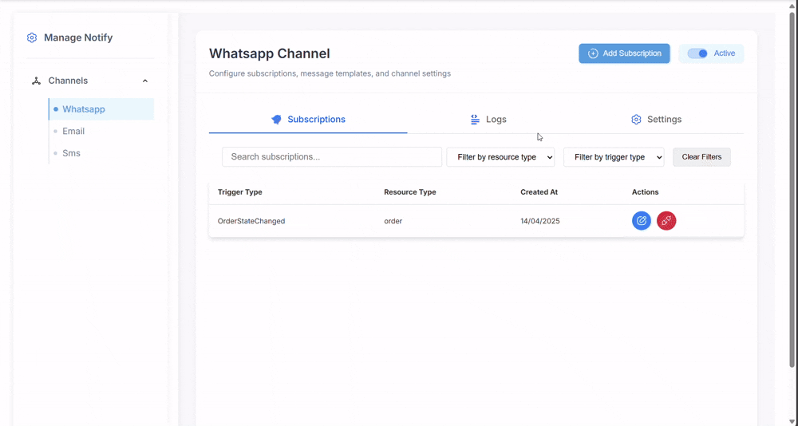

Notify is an event-driven connector designed to automate real-time message delivery through multiple communication channels such as WhatsApp, Email, and SMS. It allows users to create subscriptions through the Notify UI and offers additional options like customizing message templates and configuring channels for message delivery. Notify listens to specific events triggered in commercetools—such as order creation or status updates—and sends notifications based on the subscriptions defined within the platform.

## Features
- **Event-driven**: Notify listens to specific events triggered in commercetools and sends notifications accordingly.
- **Multi-channel support**: Supports sending notifications through WhatsApp, Email, and SMS.
- **Customizable templates**: Allows users to customize message templates for different events and channels.
- **Channel configuration**: Enables users to configure channels for message delivery.
- **Subscription management**: Users can create subscriptions through the Notify UI.
- **Real-time message delivery**: Delivers messages in real-time, ensuring timely updates to customers.
- **Scalability**: Designed to handle a high volume of messages and events.

## Available Channels
  - 📩 **Email**
  - 📱 **SMS**
  - 💬 **WhatsApp**

## Know more about Notify
- [Installing Notify into your project](docs/install_notify.md)
- [Run notify locally](docs/run_notify_locally.md)
- [Architecture](docs/basic_architecture.jpg)
- [Overall Information](docs/know_about_notify.md)
- [Customizing Templates](docs/how_to_customize_template.md)

### How to add new subscription

##

### How to edit subscription


##

```markdown
## YOU MUST HAVE
- An Twilio Account with numbers for Whatsapp & SMS is created.
- An Twilio SendGrid account and sender email is registerd
## Note
Please carefully read all the documentation to ensure a successful installation of Notify.
```