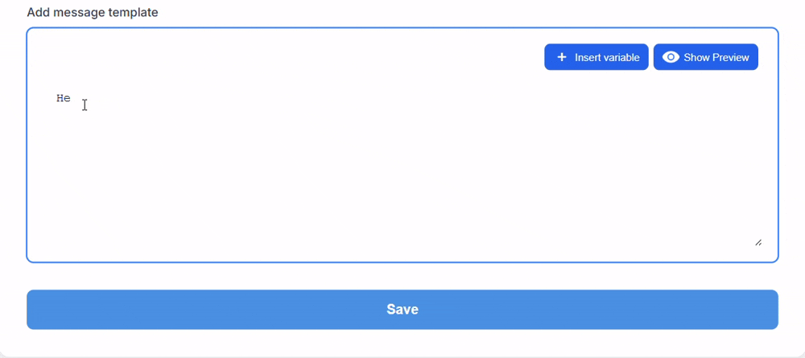

# How to configure message template

Instructions to input a custom message template into the application for sending messages through available channels. The template can be customized to include dynamic data from these **[resources](https://docs.commercetools.com/api/types#referencetypeid)**.

### Example message template

```plaintext
Hello {{shippingAddress.firstName}},\n\n your order #{{id}} has been confirmed! Total: {{totalPrice.centAmount}} {{totalPrice.currencyCode}}
```


### Placeholders

Placeholders in the message template are dynamically replaced with actual data from the resource object. Here’s a breakdown of the placeholders used in the template:

For example we use resource type **ORDER** fields.

* `{{shippingAddress.firstName}}`: Represents the first name of the customer from the order's shipping address. It refers to an attribute in the **[order](https://docs.commercetools.com/api/projects/orders#order)**

  ```json
  {
    "shippingAddress": {
      "firstName": "some_name"
    }
  }
  ```
* response JSON object:
* `{{id}}`: Refers to the unique identifier of the **[order](https://docs.commercetools.com/api/projects/orders#order)**.
* `{{totalPrice.centAmount}}`: Represents the total price of the [order ](https://docs.commercetools.com/api/projects/orders#order)in cents.
* `{{totalPrice.currencyCode}}`: Denotes the currency code for the order (e.g., USD, EUR).

If you want to set an attribute from an array of objects you can follow this instructions.

```json
"taxedPrice": {
    ...
        "taxPortions": [
            {
                "rate": 0.0725,
                "amount": {
                    "type": "centPrecision",
                    "currencyCode": "USD",
                    "centAmount": 507,
                    "fractionDigits": 2
                },
                "name": "California"
            }
        ],
       ...
    },
```

* If you want to get the `rate` value from all index you can simply modify your template placeholder like this `{{taxedPrice.taxPortions[*].rate}}`
* ```plaintext
  Hello {{shippingAddress.firstName}},\n\n your order #{{id}} has been confirmed! at rate : {{taxedPrice.taxPortions[*].rate}}
  ```
* If you want to get the `rate` value from specific index then  you can simply specify the index `[ 0, 1, 2, ... ]` like this `{{taxedPrice.taxPortions[0].rate}}`
* ```plaintext
  Hello {{shippingAddress.firstName}},\n\n your order #{{id}} has been confirmed! at rate : {{taxedPrice.taxPortions[0].rate}}
  ```

### Incorrect Formats

```plaintext
Hello, your order has been confirmed! Total: .
```

### Improper Line Breaks:

```plaintext
Hello {{shippingAddress.firstName}}, Your order #{{id}} has been confirmed!
```

* In this format, the lack of `\n` results in a cramped message.

## Requirements and Restrictions:

* **Mandatory Fields**: Ensure that all placeholders are populated with valid data from the resource response to avoid sending incomplete messages.
* **Dynamic Data**: Ensure the resource object is fully populated with the necessary attributes (e.g., `shippingAddress`, `id`, `totalPrice`) before generating the message.
* **Placeholder availability** : Ensure that the placeholders are available in the resource object to avoid errors.

## Supported services
1. Sending messages to customer on enabled trigger via WhatsApp
2. Sending messages to customer on enabled trigger via Email
3. Sending messages to customer on enabled trigger via SMS
