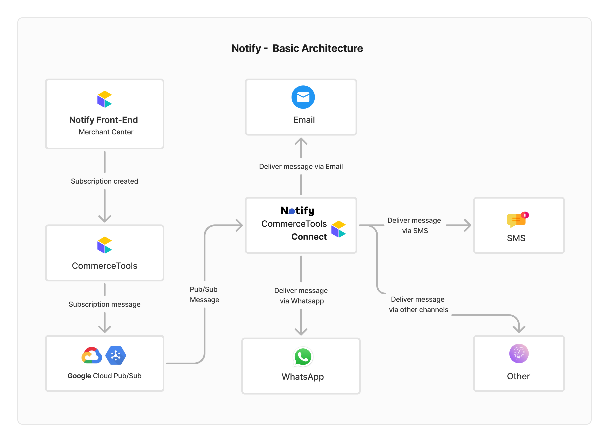

## 📝 Overview

**Notify** is an event-based connector designed to automate real-time message delivery through multiple communication channels such as **WhatsApp**, **Email**, and **SMS**. It listens to specific events triggered in commercetools—like order creations or status updates—and sends notifications based on the subscriptions defined within the platform.

Notify empowers businesses to:

- 🔔 **Enhance customer engagement** with timely and relevant updates.
- 🛠️ **Configure channel-specific message templates** for each subscription.
- 📊 **Track delivery status** of every message across all channels.
- 🧩 **Easily manage subscriptions**—create, edit, or remove subscriptions directly via the Notify UI

## 🏗️ Architecture


### Message Flow Explained

- **Subscription Creation**  
  Users create subscriptions via the Notify Front-End (Merchant Center). For example, adding an OrderStateChanged subscription through the UI creates a corresponding subscription in commercetools.

- **Event Triggered**  
  When a relevant event (like a change in order state) occurs, commercetools publishes a message to the configured Google Cloud Pub/Sub topic.

- **Message Received by Notify**  
  The Notify Connector subscribes to the Pub/Sub topic and receives the message.

- **Message Processing**  
  Upon receiving the message, the connector:
  - Parses the event payload
  - Retrieves the user-defined configurations (e.g., selected channels, message templates, recipients)
  - Determines which channels the message should be sent to

- **Message Dispatch**  
  The connector delivers the message across all configured channels:
  - 📩 **Email**
  - 📱 **SMS**
  - 💬 **WhatsApp**
  - 🔄 **Other supported or custom channels**

## ✅ Prerequisites

Before setting up and running the Notify connector, ensure you have the following environment variables and accounts configured.

### 1. Commercetools Account & API Credentials

To connect to the commercetools platform, you need to generate API credentials:

1. Log in to the commercetools Merchant Center.
2. Navigate to: **Settings → Developer settings → Create new API client**
3. Select the required scopes for managing subscriptions and orders.
4. Capture the following credentials and update these variables:

```
CTP_PROJECT_KEY=your_project_key
CTP_CLIENT_ID=your_client_id
CTP_CLIENT_SECRET=your_client_secret
CTP_SCOPE=view_orders manage_subscriptions ...
CTP_REGION=europe-west1.gcp (or applicable region)
```

### 2. Twilio Account & Authentication Keys (for WhatsApp/SMS)

1. Sign in to your [Twilio Console](https://www.twilio.com/console).
2. Go to **Account Info**.
3. Copy the following credentials:

```
TWILIO_ACCOUNT_SID=your_account_sid
TWILIO_AUTH_TOKEN=your_auth_token
```

✅ **Note:** Make sure your Twilio phone number has WhatsApp capabilities if you're using it for WhatsApp notifications.

### 3. SendGrid Account & API Key (for Email Delivery)

1. Log in to your [SendGrid account](https://app.sendgrid.com/).
2. Set up **Sender Identity** and verify a sender email address.
3. Create a new API Key and update:

```
SENDGRID_API_KEY=your_sendgrid_api_key
```

### 4. Front-end (mc-app) Credentials

1. Complete the [Custom application registration](#🛠️-configure-custom-application-for-the-front-end-via-merchant-center).
2. Copy the **Application ID** and update:

```
CUSTOM_APPLICATION_ID=your_custom_application_id
```

---

## 🛠️ Configure Custom Application for the Front-End (Via Merchant Center)

✅ Note: Setting up a Custom Application is essential for using the Notify UI.

### 📋 Steps

1. Read the [official documentation](https://docs.commercetools.com/merchant-center/managing-custom-applications) to understand the custom app deployment.

2. Navigate to **Merchant Center Settings** → **Manage organizations & teams → Your organization → Custom Applications → Configure Custom Applications**.

3. Click **"Add Custom Application"** and fill in the following fields:

| Field | Value |
|-------|-------|
| Application name | Notify |
| Application URL | Use https://example.com initially. Replace after installing Notify. |
| Application entry point URI path | notify |
| OAuth Scopes for ViewMyCustomAppRoute | [View scopes](#oauth-scopes-for-viewmycustomapproute) |
| OAuth Scopes for ManageMyCustomAppRoute | [View Manage scopes](#oauth-scopes-for-managemycustomapproute) |
| Default link label | Notify |
| Link permissions | ViewMyCustomAppRoute |

#### OAuth Scopes for ViewMyCustomAppRoute

| OAuth Scope 1 | OAuth Scope 2| OAuth Scope 3 |
|-------------|-------------|-------------|
| view_orders | view_key_value_documents | view_api_clients |
| view_approval_flows | view_approval_rules | view_associate_roles |
| view_attribute_groups | view_audit_log | view_business_units |
| view_cart_discounts | view_categories | view_checkout_transactions |
| view_customer_groups | view_customers | view_discount_codes |
| view_import_containers | view_messages | view_order_edits |
| view_payments | view_product_selections | view_products |
| view_project_settings | view_published_products | view_quote_requests |
| view_quotes | view_recurring_orders | view_sessions |
| view_shipping_methods | view_shopping_lists | view_staged_quotes |
| view_standalone_prices | view_states | view_stores |
| view_tax_categories | view_types | |


#### OAuth Scopes for ManageMyCustomAppRoute

```
manage_orders, manage_key_value_documents, manage_subscriptions
```

4. Click **Register Custom Application** and copy the **Application ID**.

---

## 🛠️ Configure Custom Application for the Front-End (Via Local Setup)

1. Clone the repository:

```bash
git clone https://github.com/donbenny0/notify-commercetools-connector.git
cd mc-notify
mc-scripts login
mc-scripts config:sync
```

2. Create and populate `.env`:

```
ENABLE_NEW_JSX_TRANSFORM=true
FAST_REFRESH=true
ENTRY_POINT_URI_PATH=notify
CLOUD_IDENTIFIER=gcp-eu
CUSTOM_APPLICATION_ID=<your_custom_application_id>
APPLICATION_URL=https://google.com
```

Refer to [CLI login guide](https://docs.commercetools.com/merchant-center-customizations/tooling-and-configuration/cli#login).

---

## 🚀 Installing Notify to Your Project

1. Complete [custom application registration](#🛠️-configure-custom-application-for-the-front-end-via-local-setup) to get the **Application ID**.

2. Go to Merchant Center → Your project → Manage Organizations & Teams → Connect → Search for **Notify** → Install and fill in all fields.

3. Go to Custom Applications → Configure Custom Applications → Choose Notify → Update **Application URL** with the copied URL from `mc-notify`.

4. Click **Save**, then change the app state to **Ready**, and install the application.

---

## ▶️ Running the Application Locally

1. Clone the integration repo:

```bash
git clone https://github.com/donbenny0/notify-commercetools-integration.git
```

2. Navigate to desired project:

```bash
cd notify-commercetools-integration/notify-event  # Backend
# or
cd notify-commercetools-integration/mc-notify     # Frontend
```

3. Install dependencies:

```bash
yarn install
```

4. Configure `.env` with all required variables.

5. Start the application:

```bash
yarn start:dev   # For backend
yarn start       # For frontend
```

---

## ❌ How to Uninstall Notify

1. Go to **Merchant Center → Connect → Manage Connectors → Installations**.
2. Select **Notify** and click **Uninstall**.
